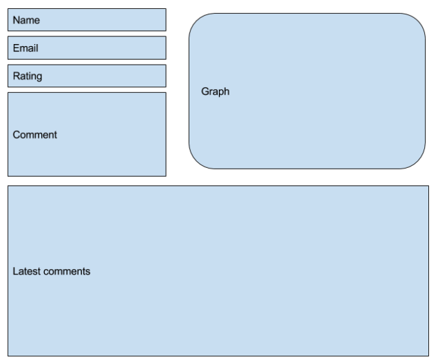

# React Technical Test

For this test, implement a customer feedback page. The page allow customers to sign up
for a form (Name, email, rating 1 to 5 stars and a ‘comment’ section). Then the page display (or
at the same time) the latest comments as well as the trends in a graph (You can use
HighChart.js or whatever library available for Charting). Consider writing tests and providing a
build script for your project. Design is not important but eventually take the opportunity to show
a bit of CSS skill by implementing a bit more than a bare bone application.

```Assessment shouldn’t take more than 2h.```

Layout example, feel free to not follow it :


