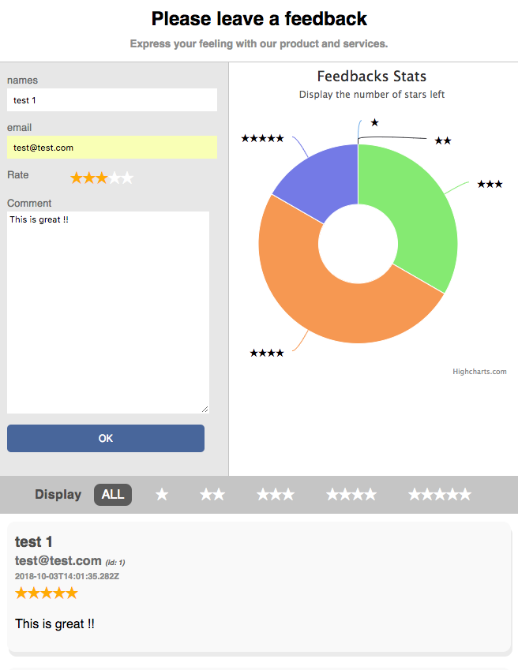

This project presents a simple Feedback App in React and Redux.
The app is an 100% Javascript Web-App.



# Installation
To launch this application please follow this instructions:
- Install in your local computer ``node``, ``yarn`` and ``npx``
- Download the source files to your local computer in ``feedback.robby.ai``
```sh
git clone git://github.com/BricePissard/feedback.robby.ai.git
```
- Install the node dependencies:
```sh
cd feedback.robby.ai
yarn install
```

- Start your local node server for testing:
```sh
yarn start
```

- Generate the build of the Web-App:
```sh
npm run build
```

- Launch Jest unit tests:
```sh
yarn test
```


# Demo

An online version can be tested here:
* http://feedback.robby.ai
